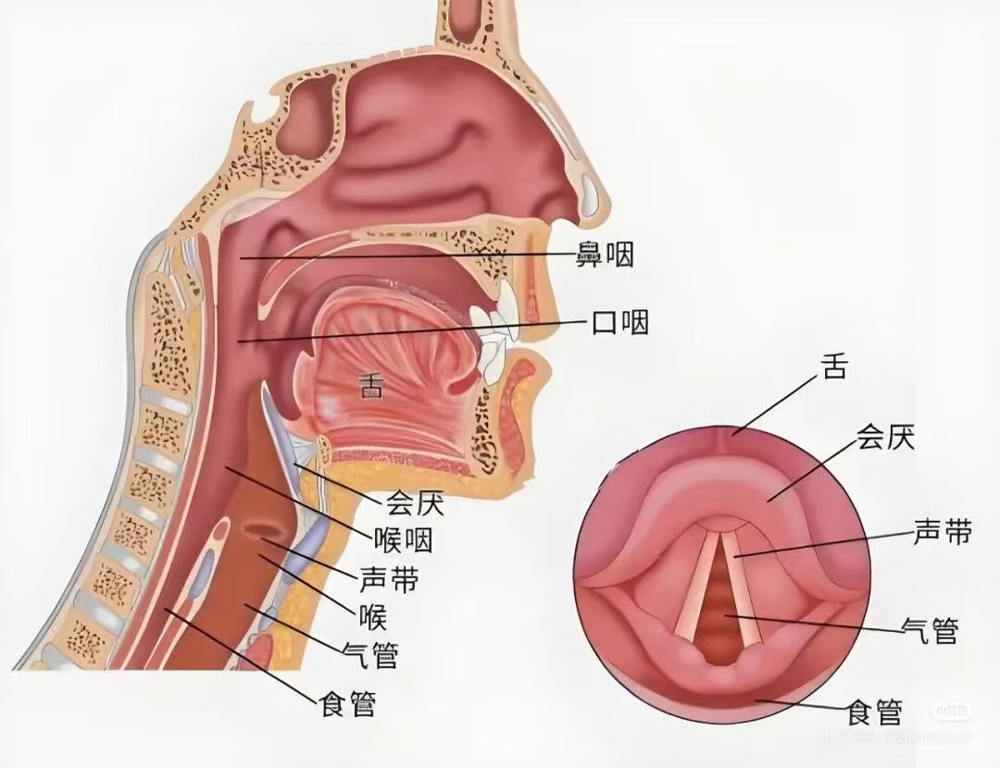
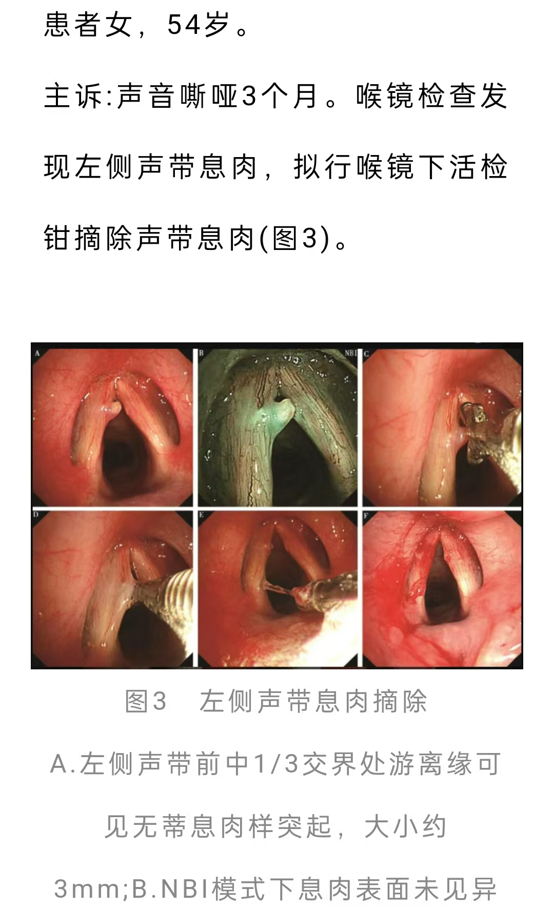

# 咽痛、声嘶病案讨论

## 病例 1

- 背景：咽痛、说话含糊不清，查体见咽部水肿、有脓性分泌物，喉部因疼痛未查
- 下一步检查：血常规、喉镜、影像学检查
- 诊断：急性会厌炎（喉头水肿）、急性化脓性扁桃体炎
- 治疗：
  1. 首要：气道管理，糖皮质激素、抗生素，支持治疗
  2. 扁桃体炎：抗生素覆盖化脓性链球菌、氯己定漱口液缓解咽部症状
  3. 一般治疗：注意饮食、半卧位减轻喉头水肿、动态监测

## 病例 2

- 咽痛加重伴张口受限，查体急性面容，张口一横指，左颌下肿胀、皮温高、触痛，既往有糖尿病史未控制
- 头颈部CT，液气平
- 诊断：颌面颈多间隙感染，糖尿病史未控制（高血糖状态易感染且不易愈合）
- 治疗：
  1. 首要：气道评估；急诊手术切开引流（脓液培养+药敏）
  2. 抗感染治疗
  3. 糖尿病管理
  4. 支持治疗
  5. 监测与随访

## 病例 3

- 声嘶半年，有左侧肺门鳞癌手术切除史，术后声嘶
- 怀疑伤到喉返神经，检查：喉镜看声带运动
- 诊断：术后喉返神经损失（一个月随访/半年处理）；先除外肿瘤复发/转移
- 治疗：
  1. 颈胸部CT除外肿瘤复发/转移，动态随访
  2. 声带麻痹处理：
     - 声带注射/填充术
     - 喉框架术

## 病例 4

- 肝移植手术后声嘶半年
- 考虑：环杓关节脱位
  
## 其他声嘶原因：
- 声带息肉、声带肿瘤、声带黏液层水肿、声带突肉芽肿、声带囊肿

## 其他补充

- 有人说声带肿瘤会导致吞咽困难？
- 喉咽：喉接气道负责呼吸，咽接食管负责吞咽

- 下图帮助分清左右

