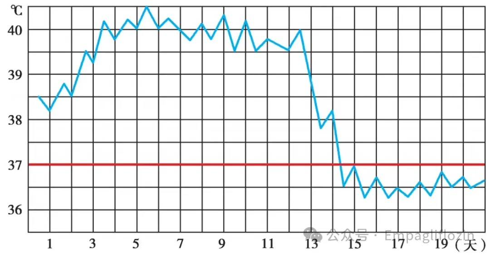
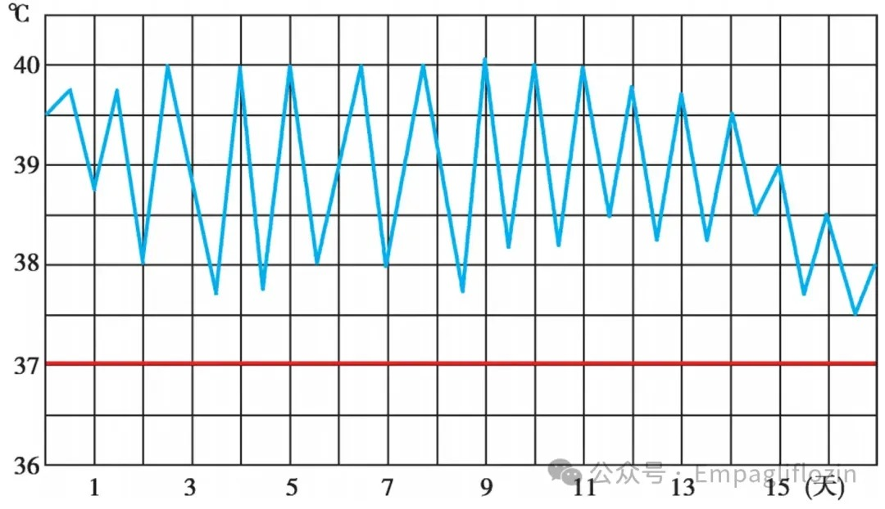
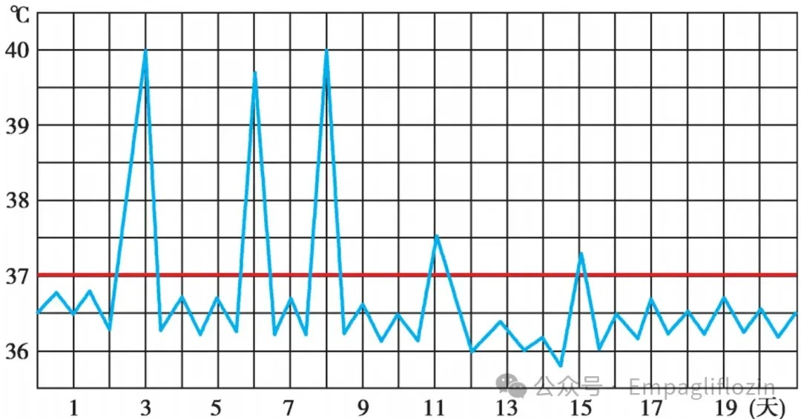
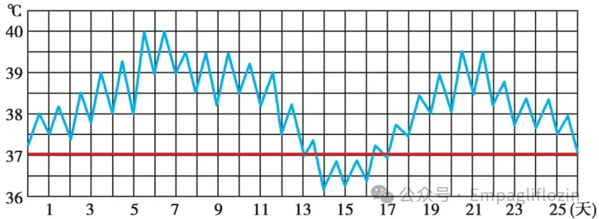
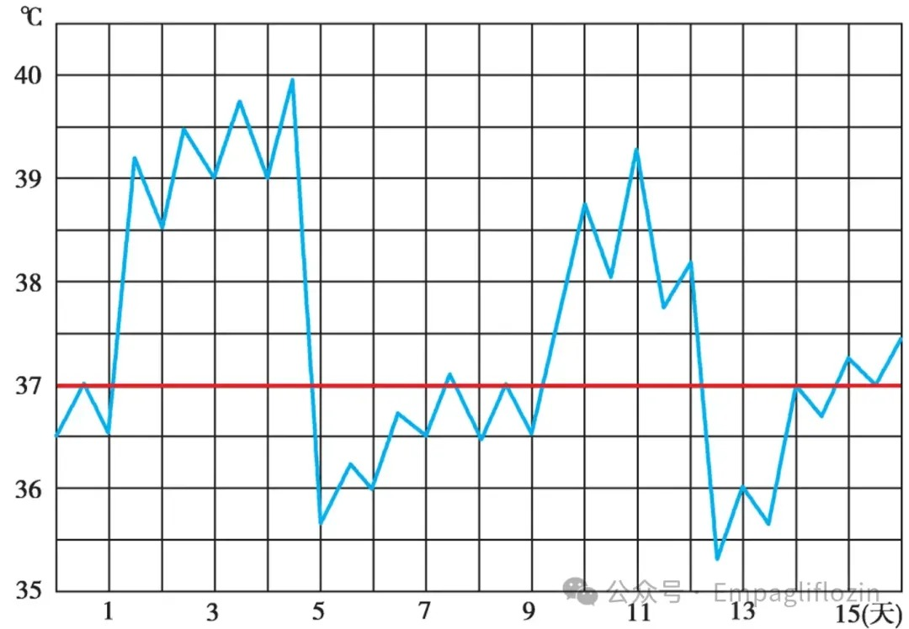
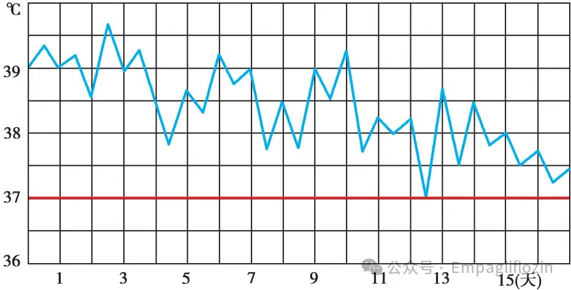
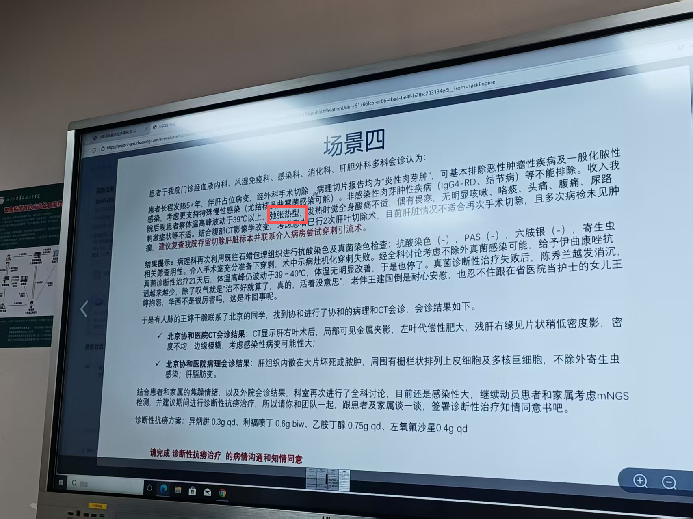

# PBL学习：热型

## 一、学习背景
本次PBL的病人主诉有两点——**发热和肝占位**，但是这个病人反反复复发热了5年，吃了头孢、布洛芬、激素都无效，所以我们对于**该病人到底是什么热型**保持着极大的好奇心。  
本文将介绍以下几点：
1. 临床上的热型分类
2. 该病人的发热特点总结以及热型推断思路
3. 该病人的热型与其他症状体征的关联

## 二、热型的基本分类

### 1. 稽留热（continued fever）
- 体温**恒定**地维持在**39-40℃以上**的高水平，达**数天或数周**
- 24小时内体温波动范围**不超过1℃**
- 常见于**大叶性肺炎、斑疹伤寒及伤寒高热期**

### 2. 弛张热（remittent fever）
- 又称**败血症**热型
- 体温常在39℃以上，波动幅度大，**24小时内波动范围超过2℃**，但**都在正常水平以上**
- 常见于**败血症、风湿热、重症肺结核及化脓性炎症**等

### 3. 间歇热（intermittent fever）
- 体温骤**升达高峰后持续数小时，又迅速降至正常水平**
- **无热期（间歇期）可持续1天至数天**，如此高热期与无热期**反复交替**出现
- 常见于**疟疾、急性肾盂肾炎**等

### 4. 波状热（undulant fever）
- 体温逐渐上升达39℃或以上，数天后又**逐渐下降**至正常水平，持续数天后又**逐渐升高**，如此反复多次
- 常见于**布鲁氏菌病**

### 5. 回归热（recurrent fever）
- 体温**急剧上升**至39℃或以上，持续数天后又**骤然下降**至正常水平
- 高热期与无热期各持续若干天后规律性交替一次
- 常见于**回归热、霍奇金（Hodgkin）淋巴瘤**等

### 6. 不规则热（irregular fever）
- 发热的体温曲线**无一定规律**
- 常见于**结核病、风湿热、支气管肺炎、渗出性胸膜炎**

## 三、该病人的发热特点

### 如果面对一个发热患者，我会先考虑：
1. 起病急还是慢
2. 发热持续多久
3. 最高体温多少
4. 是否有寒战、盗汗、皮疹、咳嗽、腹痛等伴随症状
5. 感染、肿瘤、自身免疫性疾病分别有没有支持点

### 总结发热特点：
- 发热规律
 5年前**突发起病**
 此后**长期反复发热，这5年“基本没断过”**
 每天1–2次发热，常见于下午和后半夜，时间不固定————**并非无规律，不规则热概率小**
- 体温变化特点
**最高体温可到39.5℃**
两次发热中间**最低体温也有37℃多**————**体温波动较大，排除稽留热**
从未完全降到正常体温——**都在正常水平以上**————**排除间歇热、波状热、回归热这几个有正常水平的热型**

- **最可能热型————弛张热**
  
  场景4也印证了次猜想
## 四、该病人热型的诊断意义
弛张热在本例中的意义，不是直接指向某一个明确诊断，而是提示体内可能存在**持续活动的感染或炎症过程**。    
结合患者“**发热伴肝占位**”的主诉，以及病程迁延5年、伴食欲差和水肿等表现，提示其发热并非孤立症状，而更可能与**肝脏病变本身**有关。

因此，本例中热型的价值主要在于**帮助缩小诊断范围、提示思考方向**：  
相比于单纯短暂性感染，更应考虑**肝占位相关的慢性感染性或炎症性病变**。  
但热型本身特异性有限，最终诊断仍需结合影像、病理及其他检查综合判断。

## 五、PBL学习收获
**“理解发生的瞬间，通常并不优雅。”**　
相对于传统的教学模式————课堂安静、进度顺畅、结构完整　　
这种PBL的模式给了我们自己**主动控制节奏**的机会　　
而且花一下午的充裕的时候就围绕这一个病例反复讨论这个过程本身就很奢侈

同时，以一个实际问题的探索过程穿插学习，让我们必须横向考虑多个科室（系统）的知识和临床实践经验，**极大丰富了我们知识体系**。以MDT为例，当不同科室意见相左时，也锻炼了我们的**批判性思维和临床决策力**。

