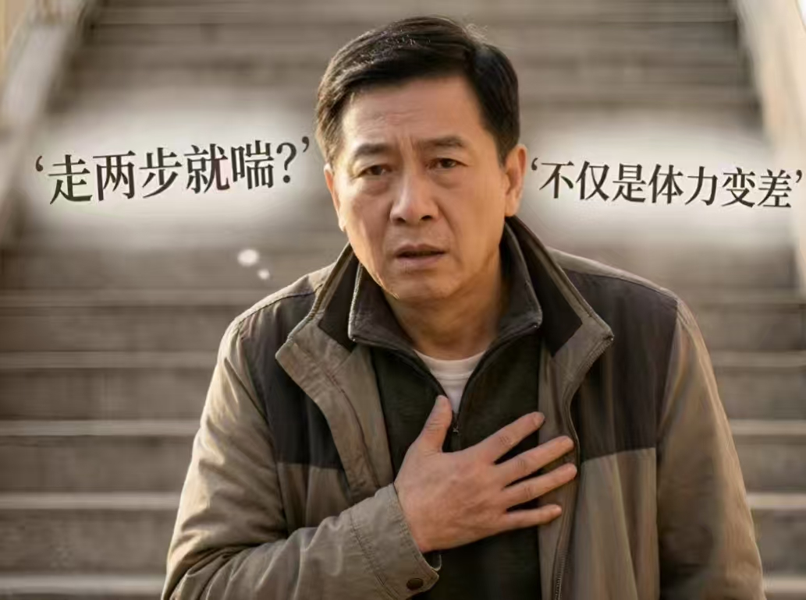
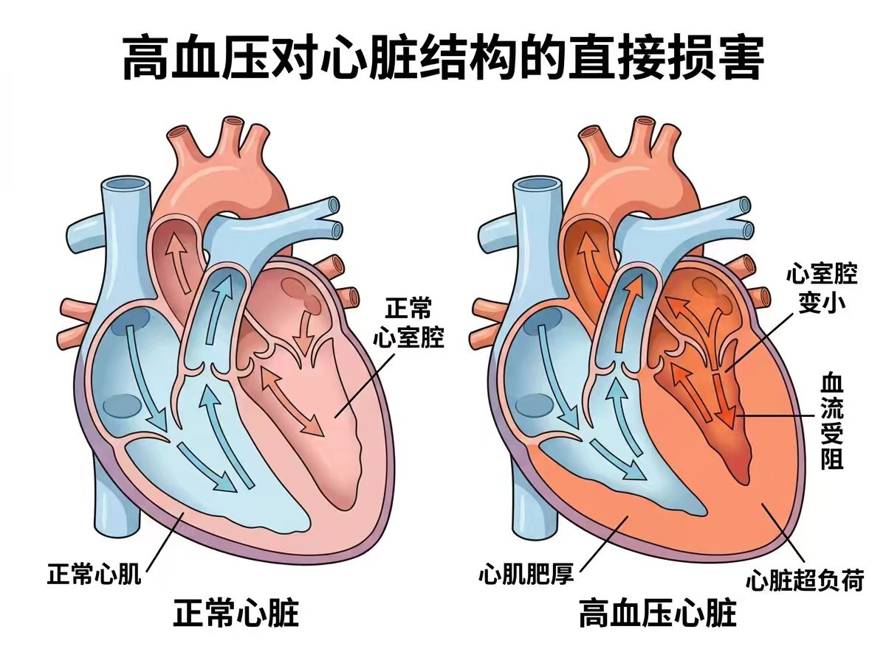
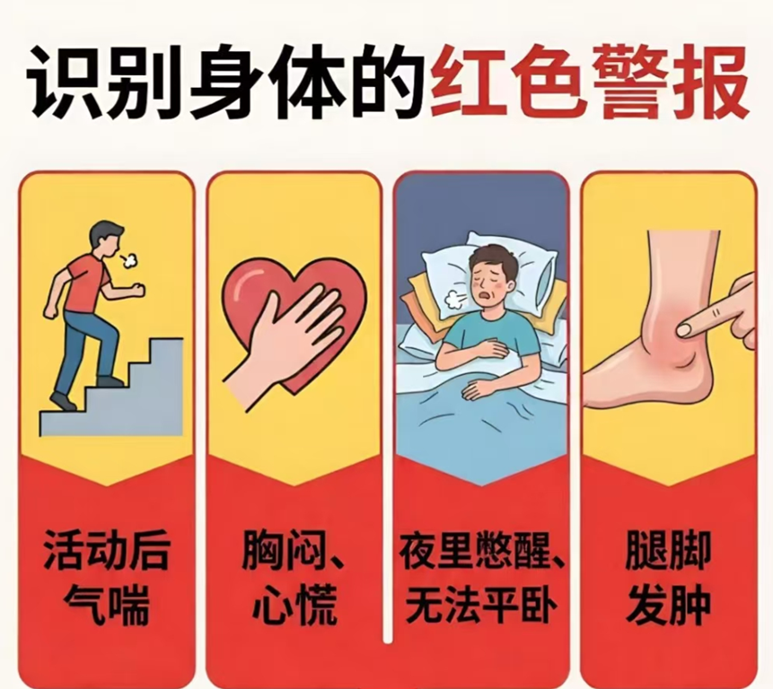
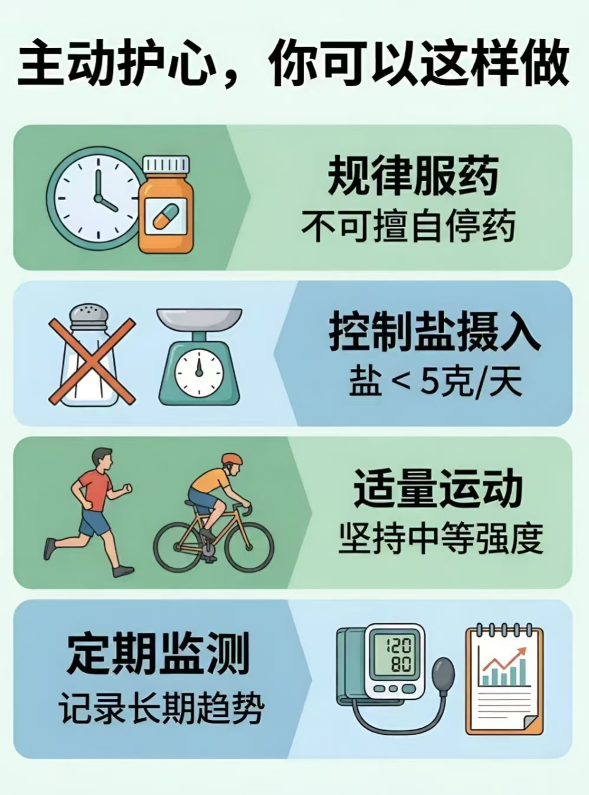

# 走几步就喘？别让高血压悄悄拖垮你的心脏

> 很多人以为，走几步就喘、胸口发闷，只是年纪大了、体力差了。  
> 可有时候，真正累坏的不是人，而是长期高血压下悄悄超负荷工作的心脏。

*看懂身体信号，学会早筛查、早干预、早预防。*

## 一、走几步就喘，只是体力变差了吗？

以前爬几层楼不觉得什么，现在走快一点就喘，做点家务也容易胸闷、乏力。很多人第一反应是：“是不是年纪大了”“最近太累了”“缺乏锻炼”。但高血压麻烦的地方就在于，它不一定先闹出很重的症状，而是在你没什么感觉的时候，就已经慢慢拖累了你的心脏。

高血压带来的心脏损害，往往不是一开始就胸痛、心慌、住院抢救，而是“比以前更容易累”“活动后更容易喘”“身体越来越不耐受”这种一点点加重的变化。这些变化看起来不重，却可能提示心脏已经长期处在超负荷工作状态。

## 二、高血压是怎么把心脏慢慢“拖垮”的？

*血压长期控制不好，会让心脏逐渐肥厚、变硬。*

说白了，高血压不仅仅是一个单纯的数字，而是在一点点把心脏“累坏”。

心脏就像一个不停工作的血泵，一收一放，把血送到全身。血压长期控制不好，等于心脏一直在用更大的力气干活。刚开始它还能硬撑；时间久了，心肌会慢慢增厚、变硬，跳动和回弹都没那么灵活了。后面还可能出现心律失常，甚至心力衰竭。

## 三、如果你属于这几类人，别等不舒服了才去查

*这些高危人群，更应该重视早期筛查。*

高血压不是每个人都会马上出问题，但下面这几类人，确实要多留个心眼。

### 1. 血压高了很多年、还总是控不好的人，要小心

血压老是高，或者一会儿高一会儿低，心脏就像天天被逼着加班；尤其夜里、清晨血压也高的人，更容易在没什么感觉的时候先把心脏拖垮了。

### 2. 本来就有糖尿病、高血脂、肥胖、肾病的人，也要小心

这些病常常不是单独来的，而是扎堆出现。它们和高血压碰到一起，心脏的压力只会更大。

### 3. 平时生活方式不太健康的人，也别觉得自己“还可以”

爱吃咸、抽烟喝酒、不运动、总熬夜、压力大，这些习惯会让血压更难降下来，也会让心脏一直“喘不过气”。

### 4. 家里有人早早得过心脏病、高血压的人，也要提高警惕

如果直系亲属年纪不大就得过冠心病、心衰，或者父母双方都有高血压，那你更需要重视筛查。

## 四、身体发出这些信号，该查什么？别硬扛

*症状和检查对应起来，才能真正看懂身体报警。*

很多人一听到“要检查”就犯嘀咕，觉得麻烦、费钱，想“忍一哈算了”。但高血压伤心脏这件事，偏偏就怕拖。对大多数高血压患者来说，最常用、也最实用的检查，就是规律测血压、做心电图，必要时做心脏彩超。

### 一活动就更容易喘、胸口发闷，要警惕心脏已经开始“吃力”了

要是走路、爬楼、做家务时比以前更容易喘，或者活动后胸闷、气短，就别只当“最近没休息好”。这类表现常提示心脏肌肉已经变厚。这个时候，除了测血压，建议尽快做心电图和心脏彩超。

### 心慌、漏跳、心跳忽快忽慢，要想到心律失常

要是经常觉得心跳不齐，像“咯噔”一下漏跳，或者一阵快一阵慢，先做常规心电图；如果发作不固定，普通心电图没抓到，还可以进一步做动态心电图。

### 夜里憋醒、躺平更喘、腿脚发肿，要警惕心衰信号

要是平躺时喘得更明显，晚上突然憋醒，或者脚踝、小腿肿起来了，这往往提示心脏泵血能力在下降。这个时候最重要的检查是心脏彩超，必要时医生还会结合抽血检查一起判断。

### 一活动就胸痛、胸闷，别忽视心脏供血不够的风险

要是在劳累、生气、受凉后出现胸口发紧发闷，甚至压榨样疼痛，通常先做心电图；如果医生怀疑缺血明显，可能还会进一步安排冠脉 CT，必要时做进一步检查。

### 下面这些情况更不能拖，最好马上就医

- 安静时也喘不上气、躺都躺不平
- 胸口剧烈疼痛迟迟不缓解，还伴有冷汗、恶心
- 心慌到眼前发黑甚至晕倒
- 突然咳粉红色泡沫痰
- 腿肿迅速加重、尿明显减少
- 血压高到 180/120 mmHg 以上，同时伴有胸闷、胸痛、剧烈头痛或呕吐

这些都不是“扛一扛就过去”的事，应尽快去医院，必要时直接去急诊。

## 五、真正护心的，不只是降压药，这几件事也很重要

*护心不是只靠吃药，而是长期管理。*

想防止高血压把心脏一步步拖垮，关键还是把血压长期控制好。落实到日常里，其实就三件事：把药吃规律，把危险因素减下来，把该做的监测和筛查做起来。

### 第一件事：药要按时吃，血压正常了也不能自己停

该吃药的时候一定要规律吃药，不要因为“这几天血压正常”就擅自停药、减药。很多患者都有一个很常见的误区：一看到血压量起来正常了，就觉得是不是“已经好了”，药也可以先停一停了。其实，血压正常，很多时候恰恰说明药物正在起作用，并不代表高血压已经消失了。

高血压最怕的，往往不是某一次血压突然高一点，而是长期控制不好、反反复复忽高忽低。今天吃、明天不吃，忙起来漏药，觉得没症状就停药，或者吃了几天见血压降下来又自己撤药，这些情况都会让血压重新升高。有些患者在突然停药后，还可能出现反跳性血压升高，也就是大家常说的“血压反弹”。血压这样反复折腾，心脏承受的负担也会一阵轻、一阵重，时间长了，更容易出现心脏肥厚、心功能下降，增加心衰、心律失常以及心脑血管意外的风险。

所以，对高血压患者来说，药不是“难受了才吃”，也不是“量着正常就停”，而是要按医生要求长期、规律地吃。能不能减药、换药、停药，不该自己做决定，而应结合家庭血压监测和医生评估来调整。对总是忘记吃药的人，可以试试定闹钟、用分装药盒，或者让家里人帮着提醒。

### 第二件事：生活方式要改，而且要改得长期坚持

饮食上最重要的是少吃盐，做菜尽量清淡一点，咸菜、腊肉、加工食品少吃，每天食盐最好控制在 5 克以下。还要尽量多吃蔬菜水果、少吃肥肉和动物油，体重偏重的人要尽量减重。

运动方面不必拼强度，快走、骑车、打太极、跳操这些中等强度运动都可以，关键是长期坚持。抽烟、喝酒、熬夜、长期压力太大，这些都在给心脏加负担，能改多少就改多少。

### 第三件事：在家测血压，也要定期查心脏

坚持家庭血压监测，不是为了看某一次高一点低一点就吓自己，而是为了长期掌握趋势，帮助医生判断治疗效果、及时调整方案。测量时最好选正规上臂式血压计，在相对规律的时间测，并把结果记下来。

## 写在最后

莫等胸闷、气短、腿肿都来了，才想起高血压伤了心。把药吃规律，把血压管起来，有问题早点来查。

## 温馨提示

> 本文仅用于健康科普，不能替代医生面对面诊疗。  
> 若已明确患有高血压，或近期出现活动后气喘、胸闷、心慌、夜间憋醒、下肢水肿等情况，建议及时到正规医院就诊评估。

## 参考文献

1. 中国高血压防治指南（2024年修订版）[J]. 中华高血压杂志（中英文）, 2024, 32(07): 603. doi:10.16439/j.issn.1673-7245.2024.07.002.  
2. 国家卫生健康委员会办公厅. 高血压营养和运动指导原则（2024年版）[J]. 国际心血管病杂志, 2025, 52(4): 287-288.  
3. Lawler PR, Hiremath P, Cheng S. Cardiac target organ damage in hypertension: insights from epidemiology[J]. Current Hypertension Reports, 2014, 16(7): 446. doi:10.1007/s11906-014-0446-8.  
4. Mohl JT, Moreno CA, Sadik K, et al. Evaluation of Blood Pressure Control, Medication Adherence, and Therapeutic Inertia in US Patients With Hypertension Prescribed Multiple Antihypertensives[J]. Journal of the American Heart Association, 2025, 14(12): e034787. doi:10.1161/JAHA.124.034787.  
5. Tucker KL, Sheppard JP, Stevens R, et al. Self-monitoring of blood pressure in hypertension: A systematic review and individual patient data meta-analysis[J]. PLoS Medicine, 2017, 14(9): e1002389. doi:10.1371/journal.pmed.1002389.  
6. Kallistratos MS, Poulimenos LE, Manolis AJ. Atrial fibrillation and arterial hypertension[J]. Pharmacological Research, 2018, 128: 322-326. doi:10.1016/j.phrs.2017.10.007.  

## 作品信息

- **作品名称**：走几步就喘？别让高血压悄悄拖垮你的心脏——高血压相关心脏病的早期识别与预防  
- **主创成员**：姚梓滢、刘懿炜、胡慧慧、冯榆翔、漆颖、冼俊熹、许达宗、武浩亮  
- **报送单位**：心脏大血管外科党支部  
- **说明**：本文标题拟定、部分文字润色和配图借助 AI 工具辅助完成，核心内容由作者团队完成并经专业审核。