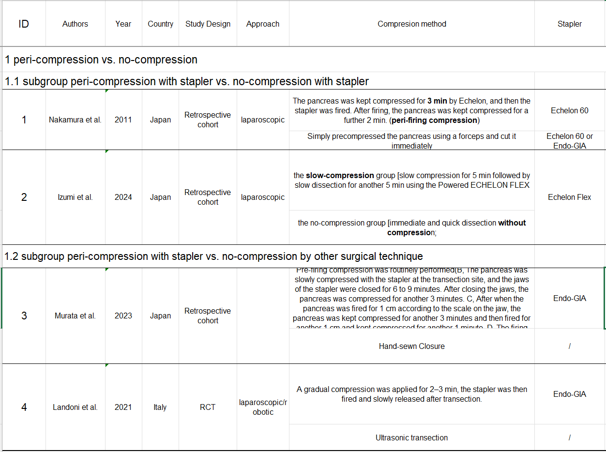
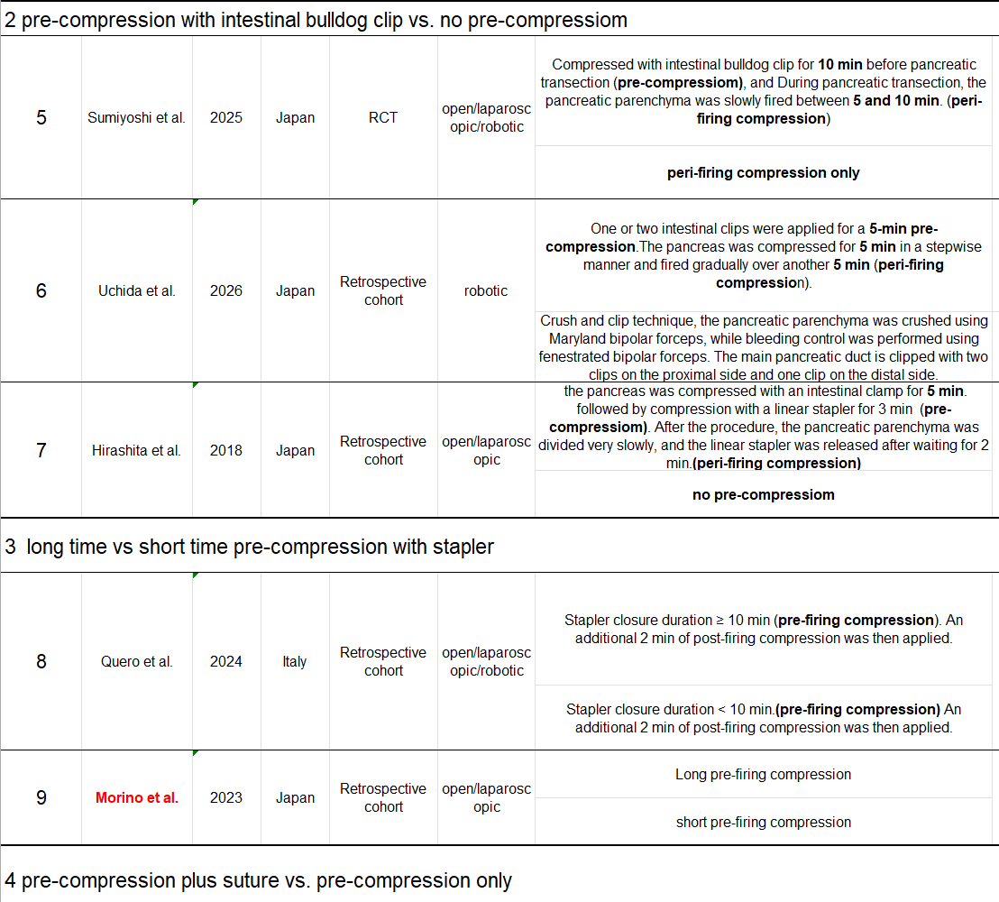

## Ongoing Research

### Are Compression-Only Strategies Sufficient to Prevent Clinically Relevant Pancreatic Fistula After Distal Pancreatectomy? A Systematic Review and Meta-analysis

**Article type:** Systematic Review and Meta-analysis  
**Status:** Major revision resubmitted  
**Role:** Co-first author  
**Period:** 2026.02–2026.06  

**My contributions:**

- 数据整理与核对
- 统计分析与敏感性分析
- 森林图、漏斗图等图表制作
- Methods 与 Results 部分初稿撰写

这项研究关注远端胰腺切除术后临床相关术后胰瘘（CR-POPF）的预防问题，重点评估单纯按压策略是否足以降低胰瘘发生风险。

## Personal Reflection｜个人思考
- 难点————分组与异质性
  研究过程中纳入文献的按压策略都太不相同，我们先后整理出了好几种分组的排列组合  
  并且分别进行了森林图和漏斗图的制作，有些Part甚至只有2篇文献，异质性也很多，很艰难

- 研究新思路————手术本身
  因为我之前的那篇文章还有一些同课题组的文章主要集中在**影像（尤其是增强CT）与PDAC或者PNETs**的预后上，而这次的Meta分析的重点完全在胰腺外科的手术实际中，术后的按压（按压方式、器具、时间长短）对**胰瘘（POPF）**发生（胰腺外科手术常见的术后并发症，及其影响生活质量）的影响。 
  我才想起来：对哦，我是在胰腺外科的课题组！ 
- 新的收获————3个软件的熟练使用
我最初想参与进来帮忙做数据分析的原因其实是**对Meta分析图表制作的复盘**。  
在我磕磕盼盼地完成了第一篇Meta分析之际，我想看看第二次弄是不是要轻车熟路一点，会不会很轻松。
结果发现在数据分析上仍然有新的收获。  
因为之前学Meta方法学部分，主要有RevMan Stata R三种分析软件，理论上第一个是傻瓜式操作，Stata基本够用，R更高级一些。所以我第一篇基本用的Stata，结果临了才发现Revman做的图更模板化标准化适合投稿，于是我把前两个软件是搞通了。  
但是我这次还是想尝试用一下R，结果过程还是有许多磕磕盼盼，但是经过这次数据分析地磨练，我把Meta分析的软件都熟练应用过了。  
- 个人思考————循序渐进，精进不休
而且我之后的一篇Article的很多图也是用的R，所以也很感谢自己当时的这段经历。  
也慢慢体会到科研是一个不断循序渐进，精进不休的过程！
