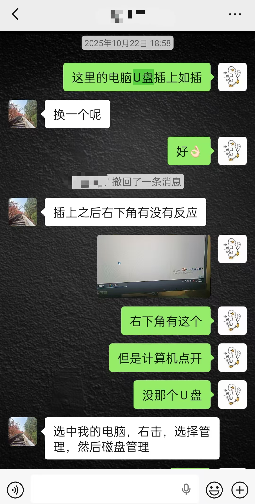
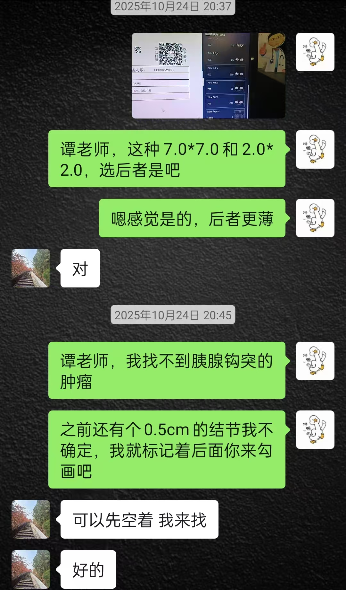

## Ongoing Research

### CT-Derived Venous-Phase Tumor-to-Parenchyma Ratio Reflects Tumor Microenvironment and Predicts Metastatic Potential in Nonfunctioning Pancreatic Neuroendocrine Tumors

**Article type:** Original Article  
**Status:** Manuscript under review  
**Role:** Co-first author  

**My contributions:**

- 负责部分 ROI 勾画及影像 CT 值提取
- 参与研究设计与论文逻辑整理
- 负责统计分析、模型建立与结果解释
- 参与图表整理与论文写作
- 参与返修材料及投稿文件准备

这项研究关注非功能性胰腺神经内分泌肿瘤（nonfunctioning pancreatic neuroendocrine tumors, NF-PNETs）中术前增强 CT 指标与肿瘤转移潜能之间的关系，重点评估静脉期肿瘤-胰腺实质强化比值（VT/VP）在风险预测中的价值。

相比单纯建立预测模型，本研究更希望回答一个更接近临床决策的问题：术前影像学指标能否帮助识别具有转移潜能的 NF-PNETs，并进一步通过病理相关分析解释其背后的肿瘤微环境基础。

## Personal Reflection｜个人思考
总结起来，这次经历有**以下几个印象深刻的点**：

- 临床ROI 勾画及影像 CT 值提取
从U盘都找不到，到不知道怎么找到影像图片，有些还检查未取图，到找到影像图片不知道选能谱的还是普通的，薄层的还是厚的，到点开图像找不到肿瘤，分不清胰腺头部 颈部 体部 尾部 钩突，找到了之后后面才知道要避开血管和囊性，录取数据的时候因为师兄只录入了静脉期，后面才知道动静脉期都要录又重录了一遍。  
还要忍受二柱5楼卡得要死的电脑，还有时不时过来问我为什么在这里的护士或者家属[流泪]

**所幸这段经历让我对医院His系统和胰腺体尾癌的增强CT阅片更为熟悉**

- 数据分析
用AI写代码，**R生成图片的最繁琐的地方在于不规范**，  
要不断调整标题和各个部分字体的大小，位置，颜色等参数  
才能使最后的图片没有把字体切割掉
最终，我生成了其他相似预测模型文章也有的图片（nomo图 ROC曲线 校准曲线 DCA曲线）

- 论文写作大方向————一定要及时沟通，而不是闷头写作
于是我开始了写作，在这过程中，我是用图表带动文章的写作，于是一篇预测模型的文章落成。  
但是开组会的时候才发现，这样的文章并没有卖点 **（要坚信老板的Taste！）**  
因为我并没有突出我们这个研究的重点：1.VT/VP这个创新性的影响指标 2.其背后可能的病理机制  
于是我又几乎重新写了一遍文章  
这次经历也让我意识到**即时沟通的重要性！**

- AI使用
最近AI在论文写作乃至科研中，占比越来越重了  
本人在这次论文写作中越发明显的感觉到，  
AI（Chatgpt）用久了之后，**在文章的写作中脑子会越来越笨，越来越僵化** 
人会被AI拖着走，**而AI生成的大概率是没有错也没有重点的车轱辘话**

所以本次的经历给我的经验是：  
每次使用Chatgpt之前，**必须严肃整理自己要表达的KeyPoints以及行文的逻辑**
AI只负责填充，这样效果才会好
