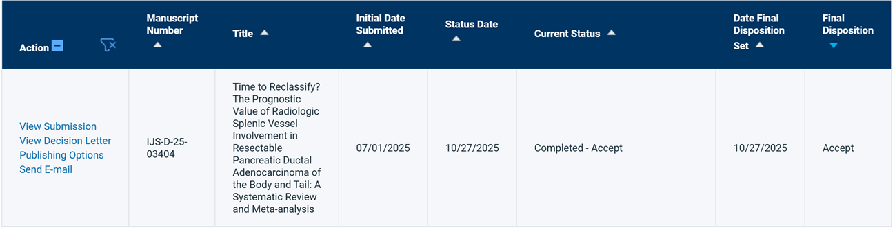
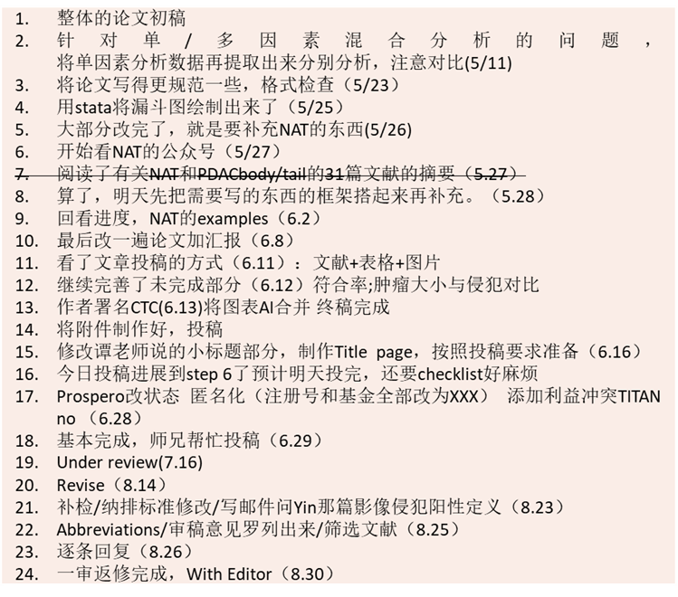

## Published Articles

### Time to Reclassify? The Prognostic Value of Radiologic Splenic Vessel Involvement in Resectable Pancreatic Ductal Adenocarcinoma of the Body and Tail: A Systematic Review and Meta-analysis

**Article type:** Systematic Review and Meta-analysis  
**Journal:** International Journal of Surgery  
**Role:** Co-first author  
**Period:** 2025.02–2025.11  

**My contributions:**

- 文献检索与筛选
- 数据提取与统计分析
- 图表制作
- 初稿撰写与修改

这项研究关注可切除胰腺体尾部导管腺癌中影像学脾血管受累的预后价值，尝试从系统综述与 Meta 分析角度评估其临床意义。